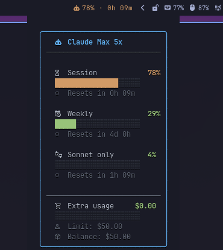

# waybar-claude-usage

Waybar widget that shows your Claude AI usage limits -- session, weekly, and per-model -- with colored progress bars and countdown timers.



## Features

- Session (5h) and weekly (7d) usage with countdown timers
- Per-model tracking (Sonnet) when available
- Extra usage tracking (spending, limit, balance) when enabled
- Pacing indicators -- are you using too fast or too slow?
- Colored progress bars in tooltip (Pango markup)
- Customizable bar text and tooltip via `--format` / `--tooltip-format` placeholders
- Granular CSS classes (`low`, `mid`, `high`, `critical`) for bar styling
- Response cache (60s TTL) -- fast even on multi-monitor setups
- Auto-refreshes OAuth token (no manual re-auth needed)
- Pure bash -- no runtime dependencies beyond `curl`, `jq`, and GNU `date`
- Works with any Waybar setup (Hyprland, Sway, etc.)

## Requirements

- [Claude CLI](https://github.com/anthropics/claude-code) -- must be logged in (`claude` command)
- Claude Pro or Max subscription
- `curl`, `jq`, GNU `date` (standard on most Linux systems)
- [Waybar](https://github.com/Alexays/Waybar)
- A [Nerd Font](https://www.nerdfonts.com/) for icons

## Installation

### From source

```bash
git clone https://github.com/mryll/waybar-claude-usage.git
cd waybar-claude-usage
make install PREFIX=~/.local
```

Or system-wide:

```bash
sudo make install
```

To uninstall:

```bash
make uninstall PREFIX=~/.local
```

### Quick install

```bash
curl -fsSL https://raw.githubusercontent.com/mryll/waybar-claude-usage/main/claude-usage \
  -o ~/.local/bin/claude-usage && chmod +x ~/.local/bin/claude-usage
```

## Waybar configuration

Add the module to your `~/.config/waybar/config.jsonc`:

```jsonc
"modules-right": ["custom/claude-usage", ...],

"custom/claude-usage": {
    "exec": "~/.local/bin/claude-usage",
    "return-type": "json",
    "interval": 60,
    "tooltip": true,
    "on-click": "xdg-open https://claude.ai/settings/usage"
}
```

Add to your `~/.config/waybar/style.css`:

```css
#custom-claude-usage {
    margin: 0 8px;
    font-size: 11px;
}

#custom-claude-usage.low {
    color: #98c379;
}

#custom-claude-usage.mid {
    color: #e5c07b;
}

#custom-claude-usage.high {
    color: #d19a66;
}

#custom-claude-usage.critical {
    color: #e06c75;
}
```

Then restart Waybar:

```bash
killall waybar && waybar &
```

## Format customization

Use `--format` to control what appears in the bar:

```bash
# Default (session usage + countdown)
claude-usage
# => 42% · 1h 30m

# Weekly usage
claude-usage --format '{icon} {weekly_pct}% · {weekly_reset}'
# => 󰚩 27% · 4d 1h

# Session + weekly
claude-usage --format '{icon} S:{session_pct}% W:{weekly_pct}%'
# => 󰚩 S:42% W:27%

# With pacing indicator
claude-usage --format '{icon} {session_pct}% {session_pace} · {session_reset}'
# => 󰚩 42% ↑ · 1h 30m

# Minimal
claude-usage --format '{icon} {session_pct}%'
# => 󰚩 42%
```

Use `--tooltip-format` for a custom plain-text tooltip (overrides the default rich tooltip):

```bash
claude-usage --tooltip-format 'Session: {session_pct}% ({session_reset}) | Weekly: {weekly_pct}% ({weekly_reset})'
```

Pass the format in your waybar config:

```jsonc
"custom/claude-usage": {
    "exec": "~/.local/bin/claude-usage --format '{icon} {session_pct}% {session_pace}'",
    "return-type": "json",
    "interval": 60,
    "tooltip": true,
    "on-click": "xdg-open https://claude.ai/settings/usage"
}
```

### Available placeholders

| Placeholder | Description | Example |
|---|---|---|
| `{icon}` | Claude icon (Nerd Font) | `󰚩` |
| `{plan}` | Plan label | Max 5x |
| `{session_pct}` | Session (5h) usage % | 42 |
| `{session_reset}` | Session countdown | 1h 30m |
| `{session_elapsed}` | Session time elapsed % | 58 |
| `{session_pace}` | Session pacing icon | ↑ / ↓ / → |
| `{session_pace_pct}` | Session pacing deviation | 12% ahead |
| `{weekly_pct}` | Weekly (7d all models) usage % | 27 |
| `{weekly_reset}` | Weekly countdown | 4d 1h |
| `{weekly_elapsed}` | Weekly time elapsed % | 42 |
| `{weekly_pace}` | Weekly pacing icon | ↑ / ↓ / → |
| `{weekly_pace_pct}` | Weekly pacing deviation | 5% under |
| `{sonnet_pct}` | Sonnet-only weekly usage % | 4 |
| `{sonnet_reset}` | Sonnet countdown | 2h 24m |
| `{extra_spent}` | Extra usage spent | $2.50 |
| `{extra_limit}` | Extra usage monthly limit | $50.00 |
| `{extra_balance}` | Extra usage balance | $47.50 |
| `{extra_pct}` | Extra usage spent % | 5 |

### Pacing indicators

Pacing compares your actual usage against where you "should" be based on elapsed time in the window:

- **↑** -- ahead of pace (using faster than sustainable)
- **→** -- on track
- **↓** -- under pace (plenty of room left)

The `{session_pace_pct}` / `{weekly_pace_pct}` placeholders show the deviation (e.g. "12% ahead", "5% under", "on track").

## How it works

1. Reads OAuth credentials from `~/.claude/.credentials.json` (created by Claude CLI)
2. Auto-refreshes the access token if it expires within 5 minutes
3. Calls `api.anthropic.com/api/oauth/usage` for live usage data (cached for 60s)
4. Outputs JSON with `text`, `tooltip` (Pango markup), and `class` for Waybar

The tooltip shows colored progress bars for each usage window (session, weekly, sonnet) with countdown timers, time elapsed, and pacing info. Colors change from green to yellow to orange to red as usage increases.

### Cache

API responses are cached in `~/.cache/claude-usage/usage.json` for 60 seconds. This keeps the widget fast (~40ms from cache vs ~1s from API), which matters if you run multiple Waybar instances (e.g. multi-monitor).

## Troubleshooting

| Bar shows | Meaning | Fix |
|---|---|---|
| `󰚩` ↻ | Syncing | Normal at boot -- data appears on next refresh |
| `󰚩` ⚠ | Auth error | Run `claude` to log in |
| `󰚩` ⚠ | Token expired | Run `claude` to re-authenticate |
| `󰚩` ⚠ | API error | Check your internet connection |
| Nothing | Module not loaded | Check waybar config and restart waybar |

## Color thresholds

| Usage | Bar color | Waybar class |
|---|---|---|
| 0-49% | Green (`#98c379`) | `low` |
| 50-74% | Yellow (`#e5c07b`) | `mid` |
| 75-89% | Orange (`#d19a66`) | `high` |
| 90-100% | Red (`#e06c75`) | `critical` |

These colors follow the One Dark theme. Edit the script to customize them.

## License

[MIT](LICENSE)

## Related

- [ClaudeBar](https://github.com/andresreibel/ClaudeBar) -- Similar widget using TypeScript/Bun
- [waybar-ai-usage](https://github.com/NihilDigit/waybar-ai-usage) -- Claude + Codex monitor (Python, uses browser cookies)
- [Waybar](https://github.com/Alexays/Waybar) -- Status bar for Wayland compositors
