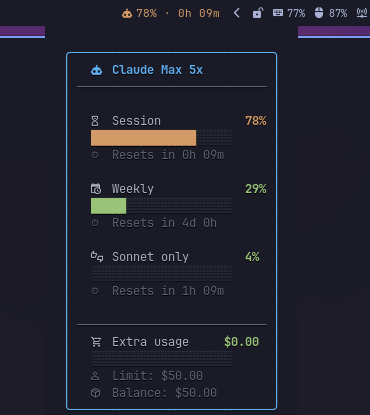

# claudebar

[](https://aur.archlinux.org/packages/claudebar)
[](LICENSE)

Waybar widget that shows your Claude AI usage limits — session, weekly, and per-model — with colored progress bars and countdown timers.

<p align="center">
  
</p>

<p align="center">
  <em>A compact line in your bar — hover for the full usage breakdown:</em><br><br>
  
</p>

## Features

- Session (5h) and weekly (7d) usage with countdown timers
- Per-model tracking (Sonnet legacy field, plus model-scoped weekly limits like Fable) when available
- Extra usage tracking (spending, limit, balance) when enabled
- Pacing indicators — ratio-based and point-based, with optional per-window coloring
- Tooltip elapsed markers — visual pacing reference in progress bars
- Colored progress bars in tooltip (Pango markup)
- Customizable bar text and tooltip via `--format` / `--tooltip-format` placeholders
- Granular CSS classes (`low`, `mid`, `high`, `critical`) for bar styling
- Response cache (60s TTL) — fast even on multi-monitor setups
- Auto-refreshes OAuth token (no manual re-auth needed)
- Pure Bash — no runtime dependencies beyond `curl`, `jq`, and GNU `date`
- Works with any Waybar setup (Hyprland, Sway, etc.)

## Requirements

- [Claude CLI](https://github.com/anthropics/claude-code) — must be logged in (`claude` command)
- Claude Pro or Max subscription
- `curl`, `jq`, GNU `date` (standard on most Linux systems)
- [Waybar](https://github.com/Alexays/Waybar)
- A [Nerd Font](https://www.nerdfonts.com/) for tooltip icons (recommended; required only for the framed tooltip — see [Framed tooltip](#framed-tooltip))
- (Optional) [Font Awesome](https://fontawesome.com/) ≥ 7.2.0 OTF for the Claude brand icon

## Installation

### Arch Linux (AUR)

```bash
yay -S claudebar
```

### From source

```bash
git clone https://github.com/mryll/claudebar.git
cd claudebar
make install PREFIX=~/.local
```

Or system-wide:

```bash
sudo make install
```

To uninstall:

```bash
make uninstall PREFIX=~/.local
```

### Quick install

```bash
curl -fsSL https://raw.githubusercontent.com/mryll/claudebar/master/claudebar \
  -o ~/.local/bin/claudebar && chmod +x ~/.local/bin/claudebar
```

## Quick start

Add the module to your `~/.config/waybar/config.jsonc`:

```jsonc
"modules-right": ["custom/claudebar", ...],

"custom/claudebar": {
    "exec": "claudebar",
    "return-type": "json",
    "interval": 300,
    "signal": 13,
    "tooltip": true,
    "on-click": "xdg-open https://claude.ai/settings/usage"
}
```

> [!WARNING]
> The usage endpoint (`/api/oauth/usage`) is undocumented and has aggressive rate limits. Intervals below 300s will likely trigger HTTP 429 errors. Even at 300s, 429s may occur during Anthropic service disruptions. When this happens, the widget falls back to cached data and shows a `⏸` indicator. See [claude-code#30930](https://github.com/anthropics/claude-code/issues/30930).

## Configuration

### Icon

Use `--icon` to prepend an icon to the widget text. The icon inherits the same color as the usage text.

**Emoji:**

```jsonc
"exec": "claudebar --icon '🤖'"
// => 🤖 42% · 1h 30m
```

**Nerd Font glyph:**

```jsonc
"exec": "claudebar --icon '󰚩'"
// => 󰚩 42% · 1h 30m
```

**Claude brand icon** (requires [Font Awesome](https://fontawesome.com/) ≥ 7.2.0 OTF):

```jsonc
"exec": "claudebar --icon \"<span font='Font Awesome 7 Brands'>&#xe861;</span>\""
```

> [!NOTE]
> On Arch Linux, install the OTF package (`sudo pacman -S otf-font-awesome`). The WOFF2 variant (`woff2-font-awesome`) does not render in Waybar due to a [Pango compatibility issue](https://github.com/Alexays/Waybar/issues/4381).

### Colors

The bar text is colored by severity level out of the box (One Dark palette):

| Class | Range | Default color |
|---|---|---|
| `low` | 0–49% | `#98c379` (green) |
| `mid` | 50–74% | `#e5c07b` (yellow) |
| `high` | 75–89% | `#d19a66` (orange) |
| `critical` | 90–100% | `#e06c75` (red) |

To override, pass `--color-*` flags in the `exec` field:

```jsonc
"custom/claudebar": {
    "exec": "claudebar --color-low '#50fa7b' --color-critical '#ff5555'",
    ...
}
```

Available flags: `--color-low`, `--color-mid`, `--color-high`, `--color-critical`.

CSS classes (`low`, `mid`, `high`, `critical`) are also emitted for additional styling via `~/.config/waybar/style.css`.

### Theming (Omarchy)

Tooltip and bar text colors are automatically read from the active [Omarchy](https://github.com/basecamp/omarchy) theme at `~/.config/omarchy/current/theme/colors.toml` on every execution. On non-Omarchy systems, the One Dark palette is used as fallback.

The priority chain is: **CLI flags** (`--color-*`) > **Omarchy theme** > **One Dark defaults**.

| Gruvbox | Catppuccin Latte | Everforest |
|:---:|:---:|:---:|
|  |  |  |

### Format customization

Use `--format` to control the bar text:

```bash
# Default (session usage + countdown)
claudebar
# => 42% · 1h 30m

# Weekly usage
claudebar --format '{weekly_pct}% · {weekly_reset}'
# => 27% · 4d 1h

# Session + weekly
claudebar --format 'S:{session_pct}% W:{weekly_pct}%'
# => S:42% W:27%

# With pacing indicator
claudebar --format '{session_pct}% {session_pace} · {session_reset}'
# => 42% ↑ · 1h 30m

# Minimal
claudebar --format '{session_pct}%'
# => 42%
```

> [!TIP]
> For icons, use `--icon` (see [Icon](#icon)) instead of embedding them in `--format`. This lets you use Pango markup to select the font, which is necessary for brand icons like Font Awesome.

Use `--tooltip-format` for a custom plain-text tooltip (overrides the default rich tooltip):

```bash
claudebar --tooltip-format 'Session: {session_pct}% ({session_reset}) | Weekly: {weekly_pct}% ({weekly_reset})'
```

Example Waybar config with custom format:

```jsonc
"custom/claudebar": {
    "exec": "claudebar --format '{session_pct}% {session_pace}'",
    "return-type": "json",
    "interval": 300,
    "signal": 13,
    "tooltip": true,
    "on-click": "xdg-open https://claude.ai/settings/usage"
}
```

#### Available placeholders

| Placeholder | Description | Example |
|---|---|---|
| `{icon}` | Claude icon (Nerd Font) | `󰚩` |
| `{plan}` | Plan label | Max 5x |
| `{session_pct}` | Session (5h) usage % | 42 |
| `{session_remaining_pct}` | Session remaining % (100 − used) | 58 |
| `{session_reset}` | Session countdown | 1h 30m |
| `{session_elapsed}` | Session time elapsed % | 58 |
| `{session_bar}` | Session usage progress bar (Pango) | `████████░░░░░░░░░░░░` |
| `{session_remaining_bar}` | Session remaining drain bar (Pango) | `███████████░░░░░░░░░` |
| `{session_pace}` | Session pacing icon (ratio-based) | ↑ / ↓ / → |
| `{session_pace_indicator}` | Session pacing icon (point-based) | ↑ / ↓ / → |
| `{session_pace_pct}` | Session pacing deviation (ratio) | 12% ahead |
| `{session_pace_pts}` | Session pacing deviation (points) | 5pts ahead |
| `{session_pace_delta}` | Session pacing delta (signed) | -12 |
| `{session_pace_abs_delta}` | Session pacing delta (unsigned) | 12 |
| `{weekly_pct}` | Weekly (7d all models) usage % | 27 |
| `{weekly_remaining_pct}` | Weekly remaining % (100 − used) | 73 |
| `{weekly_reset}` | Weekly countdown | 4d 1h |
| `{weekly_elapsed}` | Weekly time elapsed % | 42 |
| `{weekly_bar}` | Weekly usage progress bar (Pango) | `█████░░░░░░░░░░░░░░░` |
| `{weekly_remaining_bar}` | Weekly remaining drain bar (Pango) | `██████████████░░░░░░` |
| `{weekly_pace}` | Weekly pacing icon (ratio-based) | ↑ / ↓ / → |
| `{weekly_pace_indicator}` | Weekly pacing icon (point-based) | ↑ / ↓ / → |
| `{weekly_pace_pct}` | Weekly pacing deviation (ratio) | 5% under |
| `{weekly_pace_pts}` | Weekly pacing deviation (points) | 8pts under |
| `{weekly_pace_delta}` | Weekly pacing delta (signed) | -8 |
| `{weekly_pace_abs_delta}` | Weekly pacing delta (unsigned) | 8 |
| `{sonnet_pct}` | Sonnet-only weekly usage % | 4 |
| `{sonnet_remaining_pct}` | Sonnet remaining % (100 − used) | 96 |
| `{sonnet_reset}` | Sonnet countdown | 2h 24m |
| `{sonnet_elapsed}` | Sonnet time elapsed % | 42 |
| `{sonnet_bar}` | Sonnet usage progress bar (Pango) | `░░░░░░░░░░░░░░░░░░░░` |
| `{sonnet_remaining_bar}` | Sonnet remaining drain bar (Pango) | `███████████████████░` |
| `{sonnet_pace}` | Sonnet pacing icon (ratio-based) | ↑ / ↓ / → |
| `{sonnet_pace_indicator}` | Sonnet pacing icon (point-based) | ↑ / ↓ / → |
| `{sonnet_pace_pct}` | Sonnet pacing deviation (ratio) | 3% ahead |
| `{sonnet_pace_pts}` | Sonnet pacing deviation (points) | 3pts ahead |
| `{sonnet_pace_delta}` | Sonnet pacing delta (signed) | 3 |
| `{sonnet_pace_abs_delta}` | Sonnet pacing delta (unsigned) | 3 |
| `{model_name}` | Model-scoped limit model name¹ | Fable |
| `{model_pct}` | Model-scoped weekly usage % | 67 |
| `{model_remaining_pct}` | Model remaining % (100 − used) | 33 |
| `{model_reset}` | Model countdown | 1d 19h |
| `{model_elapsed}` | Model time elapsed % | 42 |
| `{model_bar}` | Model usage progress bar (Pango) | `█████████████░░░░░░░` |
| `{model_remaining_bar}` | Model remaining drain bar (Pango) | `██████░░░░░░░░░░░░░░` |
| `{model_pace}` | Model pacing icon (ratio-based) | ↑ / ↓ / → |
| `{model_pace_indicator}` | Model pacing icon (point-based) | ↑ / ↓ / → |
| `{model_pace_pct}` | Model pacing deviation (ratio) | 3% ahead |
| `{model_pace_pts}` | Model pacing deviation (points) | 3pts ahead |
| `{model_pace_delta}` | Model pacing delta (signed) | 3 |
| `{model_pace_abs_delta}` | Model pacing delta (unsigned) | 3 |
| `{extra_spent}` | Extra usage spent | $2.50 |
| `{extra_limit}` | Extra usage monthly limit | $50.00 |
| `{extra_pct}` | Extra usage spent % | 5 |
| `{extra_bar}` | Extra usage progress bar (Pango) | `█░░░░░░░░░░░░░░░░░░░` |

> [!NOTE]
> ¹ When the API reports several model-scoped limits, the tooltip shows one section per model; `{model_*}` placeholders refer to the first.

> [!NOTE]
> Bar placeholders are colored by their own window's usage thresholds (low/mid/high/critical), independently of the surrounding bar text color, which reflects the worst window overall. A `{session_bar}` can render green while the surrounding text is red because weekly, sonnet, or a model-scoped limit hit the critical threshold.

### Remaining mode

Use `--remaining` to flip the default bar text and tooltip to a "what's left" (battery) framing:

```bash
# Default (usage framing)
claudebar
# => 42% · 1h 30m

# Remaining framing
claudebar --remaining
# => 58% · 1h 30m
```

The tooltip header gains a `· Remaining` suffix, and the default bar text becomes `{session_remaining_pct}% · {session_reset}`. This flag is opt-in and fully backward compatible — it only changes the default format and tooltip header; custom `--format` / `--tooltip-format` values are unaffected.

The `{*_remaining_pct}` and `{*_remaining_bar}` placeholders are available regardless of this flag and can be used in any custom format.

### Pacing indicators

Pacing compares your actual usage against where you "should" be if you spread your quota evenly across the window. It answers: "at this rate, will I run out before the window resets?"

- **↑** — ahead of pace (using faster than sustainable)
- **→** — on track
- **↓** — under pace (plenty of room left)

**How it works:** if 30% of the session time has elapsed, you "should" have used ~30% of your quota. The widget divides your actual usage by the expected usage and flags deviations beyond a tolerance band:

| Scenario | Time elapsed | Usage | Pacing | Icon |
|---|---|---|---|---|
| Burning through quota | 25% | 60% | 140% ahead | ↑ |
| Slightly ahead | 50% | 52% | on track (within tolerance) | → |
| Perfectly even | 50% | 50% | on track | → |
| Conserving | 70% | 30% | 57% under | ↓ |

By default the tolerance is **±5%** — deviations of 5% or less show as "on track" to avoid noise. You can tune it with `--pace-tolerance`:

```bash
# More sensitive (±2%) — flags smaller deviations
claudebar --pace-tolerance 2

# More relaxed (±10%) — only flags large deviations
claudebar --pace-tolerance 10
```

The `{session_pace_pct}` / `{weekly_pace_pct}` placeholders show the deviation (e.g. "12% ahead", "5% under", "on track").

#### Point-based pacing

In addition to ratio-based pacing, there's a point-based alternative that computes `actual_usage - expected_usage`. At 22% usage with 78% elapsed, the delta is -56 — intuitive and stable across the window.

| Placeholder | Type | Example | Description |
|---|---|---|---|
| `{*_pace}` | Ratio | ↑ | Icon with tolerance band (±5% default) |
| `{*_pace_indicator}` | Points | ↑ | Icon without tolerance (any non-zero = ↑/↓) |
| `{*_pace_pct}` | Ratio | 12% ahead | Ratio-based deviation label |
| `{*_pace_pts}` | Points | 5pts ahead | Point-based deviation label |
| `{*_pace_delta}` | Points | -12 | Signed integer delta |
| `{*_pace_abs_delta}` | Points | 12 | Unsigned integer delta |

Replace `*` with `session`, `weekly`, `sonnet`, or `model`.

### Per-window pace coloring

Use `--format-pace-color` to color pace placeholders individually per window based on their point delta, instead of the global usage-based color:

```bash
claudebar --format-pace-color \
  --format '{session_pace_indicator}{session_pace_abs_delta}·{weekly_pace_indicator}{weekly_pace_abs_delta}'
# => ↑4·↓10  (↑4 in orange, ↓10 in green, · in neutral)
```

| Delta | Color | Meaning |
|---|---|---|
| ≤ -10 | Green | Well under pace |
| -10 to 0 | Yellow | Slightly under or on pace |
| 1 to 9 | Orange | Slightly ahead |
| ≥ 10 | Red | Burning fast |

Without this flag, the entire bar text is colored by usage percentage — identical to the default behavior.

### Tooltip elapsed markers

Use `--tooltip-pace-pts` to add an elapsed marker (`█`) to each tooltip progress bar, showing where even pacing would put you:

```
Without --tooltip-pace-pts:
  Session
    █████░░░░░░░░░░░░░░░  27% ↑

With --tooltip-pace-pts:
  Session
    █████░░░░░█░░░░░░░░░  27% ↑
                  ^ marker at 32% (even pace position)
```

The marker color adapts to the active theme. Without this flag, the tooltip is unchanged.

### Framed tooltip

By default the tooltip is **plain** (no border) and renders in your Waybar font, so it looks right with any font. Pass `--frame` to draw the bordered "card" instead:

```bash
claudebar --frame
```

Framed mode pins `JetBrainsMono Nerd Font Mono` **by default** so the box, bars and icons stay aligned regardless of your bar font. Don't have it (or prefer another)? Point `--frame-font` at any complete Mono Nerd Font you already have:

```bash
claudebar --frame --frame-font "FiraCode Nerd Font Mono"
```

### Spacing

Adjust `padding` (inside the widget) and `margin` (outside the widget) in `~/.config/waybar/style.css`:

```css
#custom-claudebar {
    padding: 0 8px;
    margin: 0 4px;
}
```

## How it works

1. Reads OAuth credentials from `~/.claude/.credentials.json` (created by Claude CLI)
2. Auto-refreshes the access token if it expires within 5 minutes
3. Calls `api.anthropic.com/api/oauth/usage` for live usage data (cached for 60s)
4. Outputs JSON with `text`, `tooltip` (Pango markup), and `class` for Waybar

The tooltip shows colored progress bars for each usage window (session, weekly, per-model when reported) with countdown timers, time elapsed, and pacing info. Colors change from green → yellow → orange → red as usage increases.

### Cache

API responses are cached in `~/.cache/claudebar/usage.json` for 60 seconds. This keeps the widget fast (~40ms from cache vs ~1s from API), which matters if you run multiple Waybar instances (e.g. multi-monitor).

## Troubleshooting

| Bar shows | Meaning | Fix |
|---|---|---|
| `󰚩` ↻ | Syncing | Normal at boot — data appears on next refresh |
| `󰚩` ⚠ | Auth error | Run `claude` to log in |
| `󰚩` ⚠ | Token expired | Run `claude` to re-authenticate |
| `󰚩` ⏸ | Stale data (API rate-limited) | Cached data is shown; resolves automatically |
| `󰚩` ⚠ | API error | Check your internet connection |
| Nothing | Module not loaded | Check Waybar config and restart Waybar |

## Related

- [codexbar](https://github.com/mryll/codexbar) — OpenAI Codex usage widget for Waybar
- [logibar](https://github.com/mryll/logibar) — Logitech battery widgets for Waybar
- [meteobar](https://github.com/mryll/meteobar) — Weather widget for Waybar (Open-Meteo)
- [tickerbar](https://github.com/mryll/tickerbar) — Multi-market price ticker for Waybar (crypto, stocks, forex)
- [ClaudeBar](https://github.com/andresreibel/ClaudeBar) — Similar widget using TypeScript/Bun
- [waybar-ai-usage](https://github.com/NihilDigit/waybar-ai-usage) — Claude + Codex monitor (Python, uses browser cookies)
- [Omarchy](https://github.com/basecamp/omarchy) — Beautiful, modern & opinionated Linux distribution
- [Waybar](https://github.com/Alexays/Waybar) — Status bar for Wayland compositors
