# claudebar

[](https://aur.archlinux.org/packages/claudebar)
[](LICENSE)

claudebar shows how much of your Claude AI plan you have used, in [Waybar](https://github.com/Alexays/Waybar) and in the [Omarchy](https://omarchy.org) shell. It shows the session limit, the weekly limit and the per-model limits. Each one has a progress bar, a color for the level of use, and the time until it resets.

The same core drives both frontends, so a number reads the same on either one:

| The Omarchy shell plugin | The Waybar module |
| :---: | :---: |
| 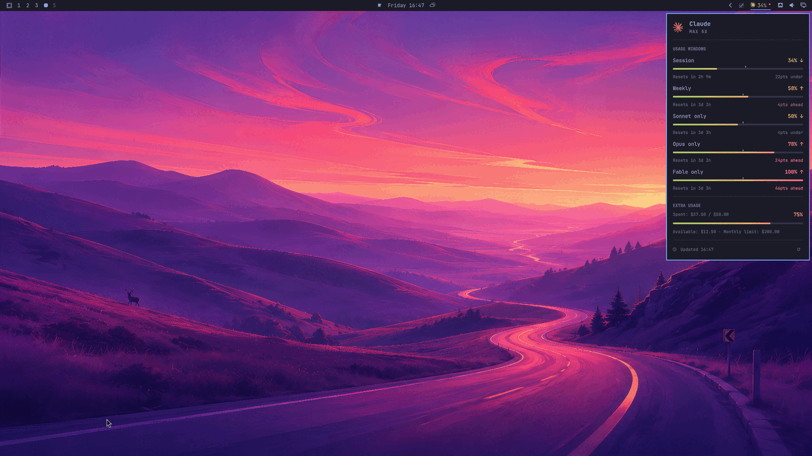 | 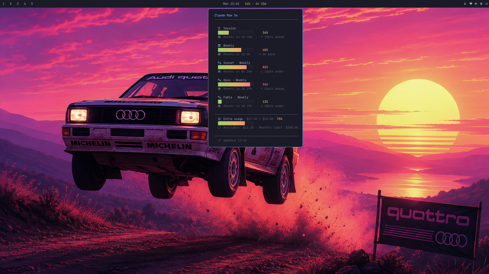 |

## Contents

- [Features](#features)
- [Requirements](#requirements)
- [Installation](#installation)
- [Quick start](#quick-start)
- [Omarchy shell plugin](#omarchy-shell-plugin)
- [Configuration](#configuration)
- [Structured JSON output](#structured-json-output)
- [How it works](#how-it-works)
- [Troubleshooting](#troubleshooting)
- [Related](#related)

## Features

- Session (5h) and weekly (7d) limits, each with a countdown to the reset.
- Per-model limits, such as a weekly limit for one model, when the API reports them.
- Extra usage: the money spent this month, the prepaid balance that is left, and the monthly limit.
- Pace indicators that compare your use with the time that has passed.
- A color gauge in the tooltip: green at 0%, amber in the middle, red at the top.
- Custom bar text and tooltip text through `--format` and `--tooltip-format`.
- CSS classes (`low`, `mid`, `high`, `critical`) for your own bar style.
- A monochrome mode for a bar without color, with support for `NO_COLOR`.
- A native plugin for the [Omarchy](https://omarchy.org) shell, with a usage panel that opens on a click.
- Structured JSON output (`--json`) for other frontends.
- Automatic refresh of the OAuth token. You do not log in again.
- Pure Bash. The only external tools are `curl`, `jq`, GNU `date`, and the standard text tools.

## Requirements

- [Claude CLI](https://github.com/anthropics/claude-code). You must be logged in with the `claude` command.
- A Claude Pro or Max subscription.
- `curl`, `jq` and GNU `date`. These are standard on most Linux systems.
- [Waybar](https://github.com/Alexays/Waybar).
- A [Nerd Font](https://www.nerdfonts.com/) for the tooltip icons, and for the rules that line up its columns. Refer to [Tooltip font](#tooltip-font).
- Optional: [Font Awesome](https://fontawesome.com/) 7.2.0 or later, in OTF format, for the Claude brand icon.

## Installation

### Arch Linux (AUR)

```bash
yay -S claudebar
```

### From source

```bash
git clone https://github.com/mryll/claudebar.git
cd claudebar
make install PREFIX=~/.local
```

To install for all users:

```bash
sudo make install
```

To remove the widget:

```bash
make uninstall PREFIX=~/.local
```

### One command

```bash
curl -fsSL https://raw.githubusercontent.com/mryll/claudebar/master/claudebar \
  -o ~/.local/bin/claudebar && chmod +x ~/.local/bin/claudebar
```

## Quick start

Add the module to your `~/.config/waybar/config.jsonc` file:

```jsonc
"modules-right": ["custom/claudebar", ...],

"custom/claudebar": {
    "exec": "claudebar",
    "return-type": "json",
    "interval": 300,
    "signal": 13,
    "tooltip": true,
    "on-click": "xdg-open https://claude.ai/settings/usage"
}
```

Run `claudebar --help` for the full reference: the usage line, every flag, and the format placeholders.

<p align="center">
  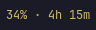
</p>

<p align="center">
  <em>A compact line in your bar. Move the pointer onto it to see all the limits:</em><br><br>
  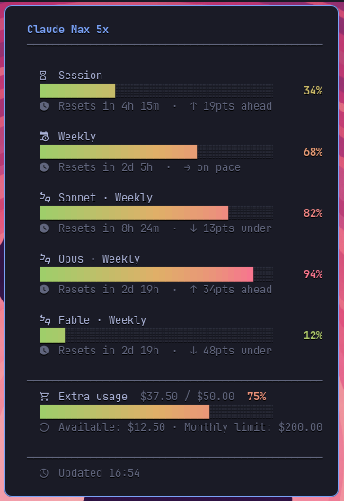
</p>

> [!WARNING]
> The OAuth usage endpoint and the prepaid-credit endpoint are not documented. The usage endpoint has strict rate limits. An interval of less than 300 seconds will usually cause HTTP 429 errors. Errors are also possible at 300 seconds if the Anthropic service has a problem. If this occurs, the widget shows the data from the cache with a `` pause sign. If the balance is not available, the widget shows it as unknown. It does not show the monthly limit in its place. Refer to [claude-code#30930](https://github.com/anthropics/claude-code/issues/30930).

## Omarchy shell plugin

claudebar also has a native plugin for the Quickshell bar of the [Omarchy](https://omarchy.org) shell. The plugin is in the `omarchy/` directory of this repository. The bar shows the Claude glyph and a short usage percentage. A click opens a panel with one section for each limit. The footer of the panel ends with a refresh control (󰑐), next to the time of the last update. The control stays disabled while a fetch runs.

<p align="center">
  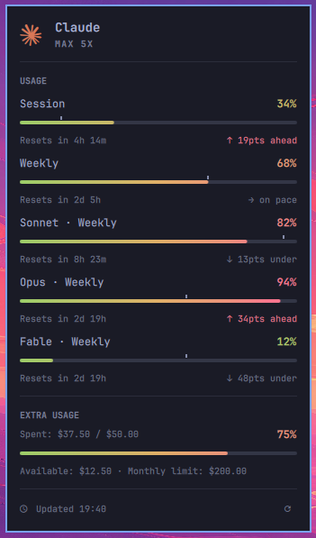
</p>

Each section has an animated progress bar, the percentage, the countdown to the reset, and the pace indicator. Below the sections, the panel shows the extra usage and the state of the cache.

Each meter paints a color gauge along its full length and fills it up to the current value. The meter reads like a thermometer against a scale. It does not change its color as one block. The CLI resolves the gauge and sends it in the `palette` field of its JSON output: the colors and also the percentages where they turn. The panel reads those stops and calculates the colors between them. Thus one change in the core moves the tooltip and the panel together. Each number takes the color of the gauge at its own value, so the number and its meter always agree.

<p align="center">
  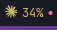
</p>

A small dot appears next to the percentage when a limit that is *not* on the bar becomes critical (90% or more). Thus a per-model limit that is almost full still gets your attention while the bar shows a comfortable session number. Move the pointer onto the widget and a tooltip gives the name of that limit, for example `Fable · Weekly: 100%`. When there is no dot, there is no tooltip, and the panel stays the full view of the data.

Mouse and keyboard controls:

| Control | Result |
|---|---|
| Left click | Open the panel |
| Middle click | Get new data now. This ignores the 60-second cache. |
| Right click | Open the claude.ai usage page |
| `r` or Enter, in the panel | Get new data now |

The plugin also answers the shell's IPC, so a keybind or a script can drive it without the mouse:

```bash
qs ipc call mryll.claudebar toggle    # open or close the panel
qs ipc call mryll.claudebar refresh   # fetch now, without opening anything
```

### Install the plugin

From the marketplace, or from this repository directly:

```bash
omarchy plugin add https://github.com/mryll/claudebar.git --enable
```

That clones the repository into `~/.config/omarchy/plugins/mryll.claudebar` and
validates the manifest before it is enabled. To remove it later:
`omarchy plugin remove mryll.claudebar`.

The plugin runs the `claudebar` CLI from your PATH, so install that too — from the AUR (`yay -S claudebar`) or with `make install PREFIX=~/.local`.

For development, link the working copy instead of cloning a second one:

```bash
make install-omarchy
```

This command makes a symbolic link from the repository to `~/.config/omarchy/plugins/mryll.claudebar`. The manifest is in the root of the repository and points to `omarchy/`.

Then add the widget to a bar section in `~/.config/omarchy/shell.json`:

```json
{
  "bar": {
    "layout": {
      "right": [
        { "id": "mryll.claudebar" }
      ]
    }
  }
}
```

> [!IMPORTANT]
> The shell does not detect file changes through a symbolic link. After you edit a plugin file, run `omarchy restart shell`. A `rescanPlugins` command finds new plugins, but it does not compile the QML again.

To remove the plugin, run `make uninstall-omarchy`. This removes only the symbolic link.

### Plugin settings

Change these settings in the settings window of the shell, or write them in the `shell.json` entry:

| Setting | Type | Default | Description |
|---|---|---|---|
| `refreshIntervalSec` | integer (60–3600) | `300` | How often to run claudebar. The API response stays in the cache for 60 seconds. A value of less than 300 can cause API rate limits. |
| `showLabel` | boolean | `true` | Show the short usage percentage next to the icon. Horizontal bars only. |
| `barWindow` | `Session` \| `Weekly` | `Session` | The limit that gives the percentage on the bar. |
| `colorMode` | `full` \| `none` \| `bar-only` \| `panel-only` | `full` | Where color is used. A monochrome surface uses only foreground tones. The numbers and the glyphs continue to show the level. This is equal to [`--no-color`](#monochrome-mode) in the CLI. |

<p align="center">
  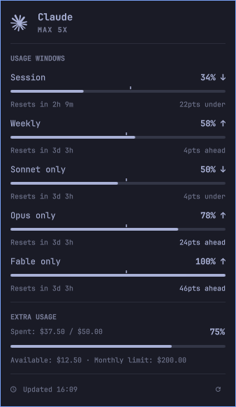
</p>

> [!NOTE]
> The Waybar mode continues to be the default mode, and it has full support. The Omarchy plugin is one more frontend on top of the same script.

## Configuration

### Icon

Use `--icon` to put an icon before the widget text. The icon takes the same color as the usage text.

An emoji:

```jsonc
"exec": "claudebar --icon '🤖'"
// => 🤖 42% · 1h 30m
```

A Nerd Font glyph:

```jsonc
"exec": "claudebar --icon '󰚩'"
// => 󰚩 42% · 1h 30m
```

The Claude brand icon. This needs [Font Awesome](https://fontawesome.com/) 7.2.0 or later in OTF format:

```jsonc
"exec": "claudebar --icon \"<span font='Font Awesome 7 Brands'>&#xe861;</span>\""
```

> [!NOTE]
> On Arch Linux, install the OTF package with `sudo pacman -S otf-font-awesome`. The WOFF2 package (`woff2-font-awesome`) does not work in Waybar because of a [Pango problem](https://github.com/Alexays/Waybar/issues/4381).

### Colors

The color of the bar text follows the level of use. These are the default colors, from the One Dark palette:

| Class | Range | Default color |
|---|---|---|
| `low` | 0–49% | `#98c379` (green) |
| `mid` | 50–74% | `#e5c07b` (yellow) |
| `high` | 75–89% | `#d19a66` (orange) |
| `critical` | 90–100% | `#e06c75` (red) |

To use other colors, add the `--color-*` flags to the `exec` field:

```jsonc
"custom/claudebar": {
    "exec": "claudebar --color-low '#50fa7b' --color-critical '#ff5555'",
    ...
}
```

The four flags are `--color-low`, `--color-mid`, `--color-high` and `--color-critical`. Each one accepts a hex color (`#rgb`, `#rgba`, `#rrggbb` or `#rrggbbaa`) or a plain color name such as `red`. Other values cause an error message in the widget.

In the tooltip these four colors are the **anchors of a gauge**, not four steps. Low sits at 0%, mid at 50%, high at 75%, and critical from 90% up. The script calculates all the colors between the anchors. Each progress bar paints that gauge along its own length: cell number *k* takes the color of the percentage at its position. Thus a bar goes from green to red from left to right, and the length of the fill shows your position on the scale. Each number next to a bar takes the color of the gauge at its own value.

The `class` field (`low`, `mid`, `high`, `critical`) stays at the four discrete steps above. Use it in `~/.config/waybar/style.css` for your own style.

### Theming (Omarchy, pywal)

The script resolves the colors of the bar and the tooltip at each execution, in this order:

| # | Source | Where |
|---|---|---|
| 1 | `--color-*` flags | your Waybar config |
| 2 | [Omarchy](https://github.com/basecamp/omarchy) theme | `$XDG_STATE_HOME/omarchy/current/theme/colors.toml`, then the older `~/.config/omarchy/current/theme/colors.toml` |
| 3 | pywal palette | `$XDG_CACHE_HOME/wal/colors.json` (usually `~/.cache/wal/colors.json`) |
| 4 | One Dark defaults | built in |

Each source fills only the colors that the sources above it did not set. Thus one `--color-critical` flag leaves the other three colors to your theme. The script reads the pywal palette **only** when there is no Omarchy theme. pywal never replaces Omarchy.

> [!NOTE]
> **Change for users of an earlier version.** The detection of the Omarchy theme did not work. The script read the path of Omarchy 3, and it also needed the old `color1` key. The result was that the tooltip used the built-in palette without a message. The colors now follow your real theme. The tooltip also has the color gauge that this page describes.

pywal support makes the widget agree with a system that does not use Omarchy. The path above is the usual one. The first [pywal](https://github.com/dylanaraps/pywal) is now an archive, but the [pywal16](https://github.com/eylles/pywal16) fork writes the same file, and [wallust](https://codeberg.org/explosion-mental/wallust) has a target that is compatible with pywal. Thus the three tools work with no configuration.

The script maps `special.foreground` and `special.background` to the text and the surfaces. It maps `colors.color1` to red, `color2` to green, `color3` to yellow, and `color4` (or `special.cursor`) to the accent. pywal has no slot for orange, so the script calculates orange as the middle point between yellow and red. This keeps four different steps in the gauge. A key that is not there keeps its built-in default. A value that is not a hex color is ignored. A `colors.json` file that is absent, unreadable or damaged causes no error: the script uses the One Dark colors.

| Flexoki Light | Rosé Pine | Hackerman |
|:---:|:---:|:---:|
| 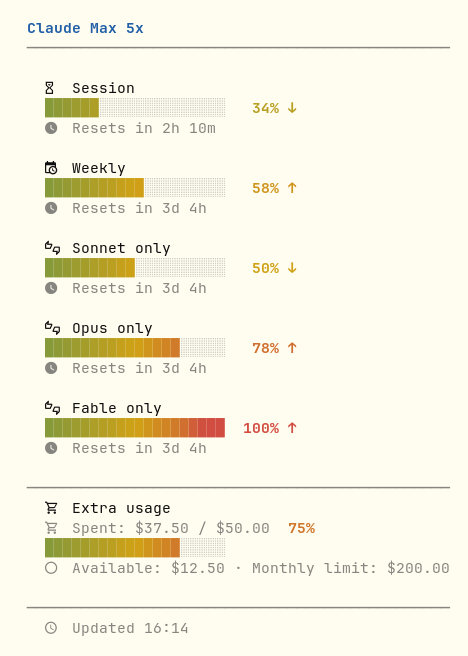 | 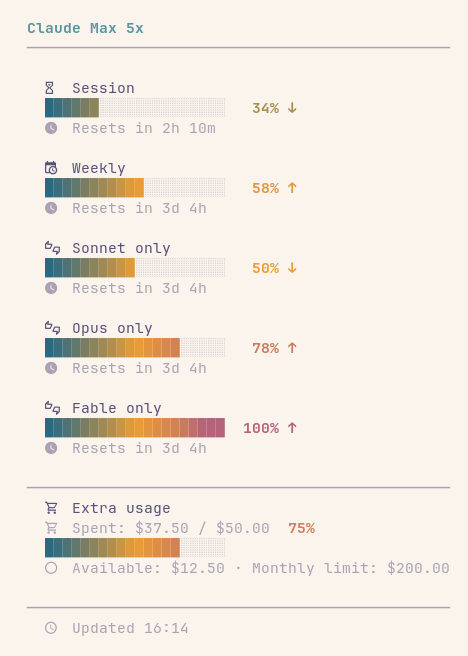 | 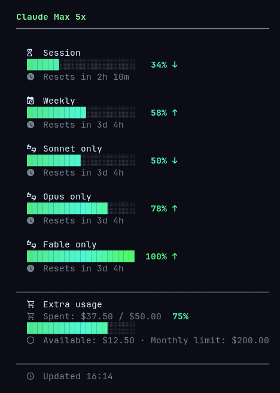 |

| Ristretto | Nord | Kanagawa |
|:---:|:---:|:---:|
| 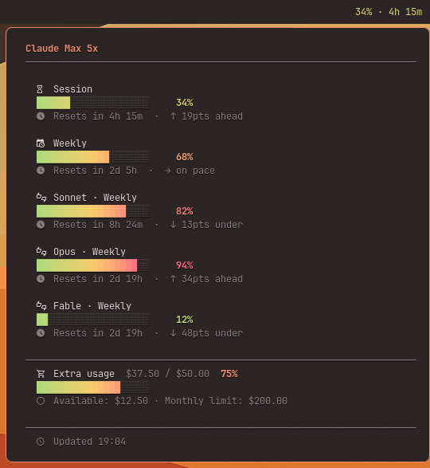 | 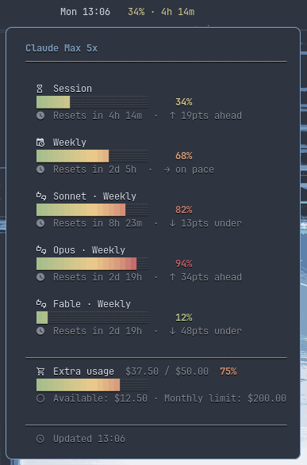 | 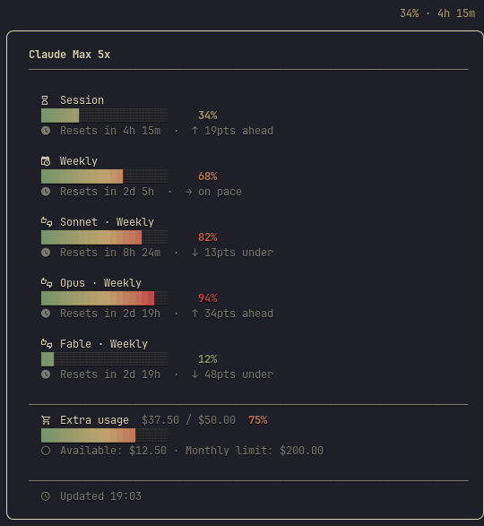 |

The Omarchy plugin follows the same theme. These are three Omarchy themes in the panel:

| Flexoki Light | Rosé Pine | Hackerman |
|:---:|:---:|:---:|
| 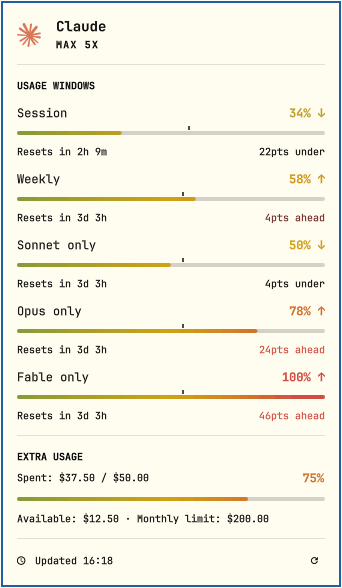 | 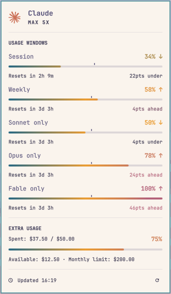 | 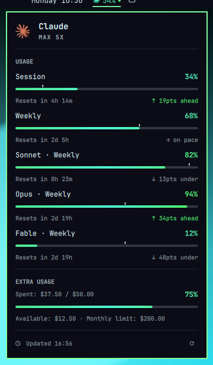 |

| Ristretto | Nord | Kanagawa |
|:---:|:---:|:---:|
| 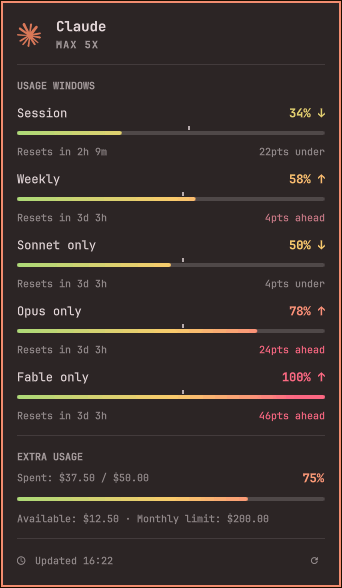 | 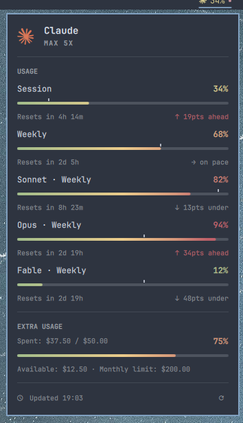 | 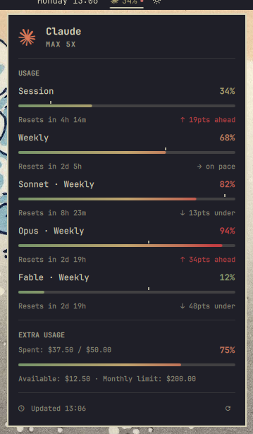 |

### Monochrome mode

Do you prefer a bar without color? `--no-color` removes the color from all surfaces, or from one surface only:

```jsonc
"custom/claudebar": {
    "exec": "claudebar --no-color",         // plain bar text and plain tooltip
    // "exec": "claudebar --no-color=bar",     // plain bar, colored tooltip
    // "exec": "claudebar --no-color=tooltip", // colored bar, plain tooltip
    ...
}
```

| Command | Bar text | Tooltip |
|---|---|---|
| *(no flag)* | color | color |
| `--no-color` or `--no-color=all` | plain | plain |
| `--no-color=bar` | plain | color |
| `--no-color=tooltip` | color | plain |

<p align="center">
  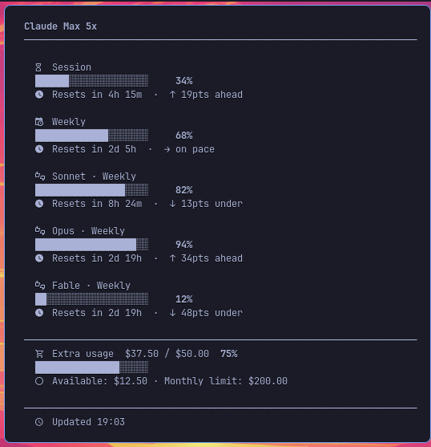
</p>

Plain means no color markup. Nothing else changes. The progress bars, the markers, the icons, the box lines, the bold text and all the numbers stay in their positions. The flag also removes color markup that you wrote yourself in a `--format` or `--tooltip-format` value.

The widget obeys the [`NO_COLOR`](https://no-color.org) environment variable. Set it to any value that is not empty and the widget operates as with `--no-color=all`. A flag is a more specific instruction than the variable, so `NO_COLOR=1 claudebar --no-color=tooltip` keeps the color in the bar text.

> [!TIP]
> **Monochrome plus CSS: make your own style.** The `class` field (`low`, `mid`, `high`, `critical`) does not change in monochrome mode. Thus you can remove the built-in colors and control the bar from your own stylesheet:
>
> ```css
> #custom-claudebar.high     { color: #d79921; }
> #custom-claudebar.critical { color: #cc241d; font-weight: bold; }
> ```

The Omarchy plugin has the same four modes in its **Colors** setting (`full`, `none`, `bar-only`, `panel-only`). Refer to the [settings table](#plugin-settings).

### Bar text and tooltip text

Use `--format` to control the bar text:

```bash
# Default (session usage + countdown)
claudebar
# => 42% · 1h 30m

# Weekly usage
claudebar --format '{weekly_pct}% · {weekly_reset}'
# => 27% · 4d 1h

# Session + weekly
claudebar --format 'S:{session_pct}% W:{weekly_pct}%'
# => S:42% W:27%

# With pacing indicator
claudebar --format '{session_pct}% {session_pace} · {session_reset}'
# => 42% ↑ · 1h 30m

# Minimal
claudebar --format '{session_pct}%'
# => 42%
```

> [!TIP]
> For icons, use `--icon` (refer to [Icon](#icon)). Do not put icons in `--format`. The `--icon` flag lets you select the font with Pango markup, which is necessary for brand icons such as Font Awesome.

Use `--tooltip-format` for a tooltip of plain text. It replaces the default tooltip:

```bash
claudebar --tooltip-format 'Session: {session_pct}% ({session_reset}) | Weekly: {weekly_pct}% ({weekly_reset})'
```

A Waybar config with a custom format:

```jsonc
"custom/claudebar": {
    "exec": "claudebar --format '{session_pct}% {session_pace}'",
    "return-type": "json",
    "interval": 300,
    "signal": 13,
    "tooltip": true,
    "on-click": "xdg-open https://claude.ai/settings/usage"
}
```

#### Placeholders

| Placeholder | Description | Example |
|---|---|---|
| `{icon}` | The widget mark, in the Nerd Font | `󰚩` |
| `{plan}` | Plan label | Max 5x |
| `{session_pct}` | Session (5h) usage % | 42 |
| `{session_remaining_pct}` | Session left % (100 − used) | 58 |
| `{session_reset}` | Session countdown | 1h 30m |
| `{session_elapsed}` | Session time that has passed, in % | 58 |
| `{session_bar}` | Session usage bar (Pango) | `████████░░░░░░░░░░░░` |
| `{session_remaining_bar}` | Session bar that empties (Pango) | `███████████░░░░░░░░░` |
| `{session_pace}` | Session pace icon (ratio) | ↑ / ↓ / → |
| `{session_pace_indicator}` | Session pace icon (points) | ↑ / ↓ / → |
| `{session_pace_pct}` | Session pace difference (ratio) | 12% ahead |
| `{session_pace_pts}` | Session pace difference (points) | 5pts ahead |
| `{session_pace_delta}` | Session pace difference, with sign | -12 |
| `{session_pace_abs_delta}` | Session pace difference, no sign | 12 |
| `{weekly_pct}` | Weekly (7d, all models) usage % | 27 |
| `{weekly_remaining_pct}` | Weekly left % (100 − used) | 73 |
| `{weekly_reset}` | Weekly countdown | 4d 1h |
| `{weekly_elapsed}` | Weekly time that has passed, in % | 42 |
| `{weekly_bar}` | Weekly usage bar (Pango) | `█████░░░░░░░░░░░░░░░` |
| `{weekly_remaining_bar}` | Weekly bar that empties (Pango) | `██████████████░░░░░░` |
| `{weekly_pace}` | Weekly pace icon (ratio) | ↑ / ↓ / → |
| `{weekly_pace_indicator}` | Weekly pace icon (points) | ↑ / ↓ / → |
| `{weekly_pace_pct}` | Weekly pace difference (ratio) | 5% under |
| `{weekly_pace_pts}` | Weekly pace difference (points) | 8pts under |
| `{weekly_pace_delta}` | Weekly pace difference, with sign | -8 |
| `{weekly_pace_abs_delta}` | Weekly pace difference, no sign | 8 |
| `{sonnet_pct}` | Sonnet weekly usage % | 4 |
| `{sonnet_remaining_pct}` | Sonnet left % (100 − used) | 96 |
| `{sonnet_reset}` | Sonnet countdown | 2h 24m |
| `{sonnet_elapsed}` | Sonnet time that has passed, in % | 42 |
| `{sonnet_bar}` | Sonnet usage bar (Pango) | `░░░░░░░░░░░░░░░░░░░░` |
| `{sonnet_remaining_bar}` | Sonnet bar that empties (Pango) | `███████████████████░` |
| `{sonnet_pace}` | Sonnet pace icon (ratio) | ↑ / ↓ / → |
| `{sonnet_pace_indicator}` | Sonnet pace icon (points) | ↑ / ↓ / → |
| `{sonnet_pace_pct}` | Sonnet pace difference (ratio) | 3% ahead |
| `{sonnet_pace_pts}` | Sonnet pace difference (points) | 3pts ahead |
| `{sonnet_pace_delta}` | Sonnet pace difference, with sign | 3 |
| `{sonnet_pace_abs_delta}` | Sonnet pace difference, no sign | 3 |
| `{model_name}` | Name of the model with its own limit¹ | Fable |
| `{model_pct}` | Model weekly usage % | 67 |
| `{model_remaining_pct}` | Model left % (100 − used) | 33 |
| `{model_reset}` | Model countdown | 1d 19h |
| `{model_elapsed}` | Model time that has passed, in % | 42 |
| `{model_bar}` | Model usage bar (Pango) | `█████████████░░░░░░░` |
| `{model_remaining_bar}` | Model bar that empties (Pango) | `██████░░░░░░░░░░░░░░` |
| `{model_pace}` | Model pace icon (ratio) | ↑ / ↓ / → |
| `{model_pace_indicator}` | Model pace icon (points) | ↑ / ↓ / → |
| `{model_pace_pct}` | Model pace difference (ratio) | 3% ahead |
| `{model_pace_pts}` | Model pace difference (points) | 3pts ahead |
| `{model_pace_delta}` | Model pace difference, with sign | 3 |
| `{model_pace_abs_delta}` | Model pace difference, no sign | 3 |
| `{extra_spent}` | Extra usage, money spent | $2.50 |
| `{extra_limit}` | Extra usage, monthly limit | $50.00 |
| `{extra_pct}` | Money spent as a % of spend plus prepaid balance. Empty if the balance is unknown. | 20 |
| `{extra_bar}` | Bar of the real funded credit. Empty if the balance is unknown. | `████░░░░░░░░░░░░░░░░` |

> [!NOTE]
> ¹ If the API reports more than one model limit, the tooltip shows one section for each model. The `{model_*}` placeholders refer to the first model.

> [!NOTE]
> Each bar placeholder takes its color from its own limit, not from the text around it. The text around it shows the highest of all the limits. Thus `{session_bar}` can be green while the text is red, because the weekly, the sonnet or a model limit is critical.

### Remaining mode

Use `--remaining` to show what is left, as a battery does, in the default bar text and in the tooltip:

```bash
# Default (usage framing)
claudebar
# => 42% · 1h 30m

# Remaining framing
claudebar --remaining
# => 58% · 1h 30m
```

The tooltip header gets a `· Remaining` suffix, and the default bar text becomes `{session_remaining_pct}% · {session_reset}`. The flag changes only the default format and the tooltip header. Your own `--format` and `--tooltip-format` values do not change.

The `{*_remaining_pct}` and `{*_remaining_bar}` placeholders are available with or without this flag.

### Pace indicators

The pace compares your use with the time that has passed in the limit period. It answers this question: at this rate, will the quota end before the reset?

- **↑** — ahead of the pace. You use the quota faster than the time.
- **→** — on the pace.
- **↓** — behind the pace. Much of the quota is left.

If 30% of the session time has passed, an even use is 30% of the quota. The script divides your real use by that expected use, and shows a difference that is larger than a tolerance band:

| Example | Time passed | Use | Pace | Icon |
|---|---|---|---|---|
| Very fast use | 25% | 60% | 140% ahead | ↑ |
| A little ahead | 50% | 52% | on the pace (in the band) | → |
| Fully even | 50% | 50% | on the pace | → |
| Slow use | 70% | 30% | 57% under | ↓ |

The default band is **±5%**. A difference of 5% or less shows as "on pace". Change the band with `--pace-tolerance`:

```bash
# More sensitive (±2%) — flags smaller deviations
claudebar --pace-tolerance 2

# More relaxed (±10%) — only flags large deviations
claudebar --pace-tolerance 10
```

The `{session_pace_pct}` and `{weekly_pace_pct}` placeholders show the difference, for example "12% ahead", "5% under" or "on pace".

#### Pace in points

There is a second calculation in points: real use minus expected use. At 22% use with 78% of the time passed, the difference is -56 points. This number is easy to read and it is stable during the period.

| Placeholder | Type | Example | Description |
|---|---|---|---|
| `{*_pace}` | Ratio | ↑ | Icon with a tolerance band (±5% default) |
| `{*_pace_indicator}` | Points | ↑ | Icon with no band (any value that is not zero) |
| `{*_pace_pct}` | Ratio | 12% ahead | Difference as a ratio |
| `{*_pace_pts}` | Points | 5pts ahead | Difference in points |
| `{*_pace_delta}` | Points | -12 | Integer with sign |
| `{*_pace_abs_delta}` | Points | 12 | Integer with no sign |

Replace `*` with `session`, `weekly`, `sonnet` or `model`.

### One color for each pace

Use `--format-pace-color` to give each pace placeholder its own color from its point difference. Without this flag, the usage color applies to all the bar text.

```bash
claudebar --format-pace-color \
  --format '{session_pace_indicator}{session_pace_abs_delta}·{weekly_pace_indicator}{weekly_pace_abs_delta}'
# => ↑4·↓10  (↑4 in orange, ↓10 in green, · in neutral)
```

| Difference | Color | Meaning |
|---|---|---|
| ≤ -10 | Green | Much slower than the pace |
| -10 to 0 | Yellow | A little slower, or on the pace |
| 1 to 9 | Orange | A little ahead |
| ≥ 10 | Red | Very fast use |

### Markers in the tooltip

Use `--tooltip-pace-pts` to add a marker (`┃`) to each progress bar in the tooltip. The marker shows where an even pace would have you:

```
Without --tooltip-pace-pts:
  ██████░░░░░░░░░░░░░░     34%

With --tooltip-pace-pts:
  ██████░░░░░┃░░░░░░░░     34%
             ^ even-pace position
```

The color of the marker follows the active theme. Without this flag, the tooltip does not change.

### Tooltip font

The tooltip is pinned to a monospace font. That is not decoration: its rules are box-drawing characters, and in a proportional font one of those is nearly twice as wide as a letter. The tooltip then sizes itself to the rules, and a dead margin opens to the right of the text. Waybar draws the tooltip in a GTK window that ignores `font-family` from your CSS, so the markup is the only place this can be said.

The default is a **list** of families, tried in order:

```
JetBrainsMono Nerd Font Mono, JetBrainsMono Nerd Font, monospace
```

Pango falls through to the next name when one is not installed. This matters: the Arch package `ttf-jetbrains-mono-nerd` does **not** ship the `…Mono` family, so pinning that one name alone used to fall back to your system's proportional font without saying so.

To use a different font, name any monospace family (or your own list):

```bash
claudebar --tooltip-font "FiraCode Nerd Font Mono"
```

> [!NOTE]
> **`--frame` and `--frame-font` are deprecated.** `--frame` drew the tooltip as a bordered card. It is still accepted, so an existing Waybar config keeps working, but it now does nothing; `--frame-font` is an alias for `--tooltip-font`.
>
> The box was a second way of drawing the same content — more code, more documentation, more screenshots — and it only lined up when the pinned font was a complete Mono Nerd Font. Pinning the font on the one remaining tooltip gives the alignment without the box.

### Space around the widget

Set `padding` (inside the widget) and `margin` (outside the widget) in `~/.config/waybar/style.css`:

```css
#custom-claudebar {
    padding: 0 8px;
    margin: 0 4px;
}
```

## Structured JSON output

`claudebar --json` prints one JSON object with the data and no markup. Use this output for your own bar, your own script, or a status page. The command always exits with 0, and it always prints valid JSON, also after an error.

```bash
claudebar --json | jq
claudebar --json --refresh   # force a fresh API fetch
```

| Field | Contains |
|---|---|
| `schema_version` | The version of this format. It is `2` |
| `error` | `null`, or an object with a `message` when there is no document at all |
| `loading` | `true` while there is no data yet |
| `plan` | The plan name |
| `state` | The state of the fullest window: `low`, `mid`, `high`, or `critical` |
| `max_pct` | The percentage of that fullest window |
| `windows` | One entry for each limit. See below |
| `extra_usage` | The extra-usage ledger. See below |
| `palette` | The colors of the gauge, and the `stops` that give the ramp |
| `stale` | `true` when the data is not new |
| `stale_reason` | `network` or `error` |
| `updated_at` | The time of the data, in ISO 8601 |
| `data_age_seconds` | The age of the data, in seconds |
| `last_error` | The last error from the API, with `http_status` and `message` |

Each entry in `windows` has: `id`, `label`, `group` (the meter it belongs to, for a per-model limit), `used_pct`, `remaining_pct`, `reset_at`, `reset_at_unix`, `window_seconds`, `elapsed_pct`, `state`, and a `pace` object.

The `pace` object has `delta_points` (your use minus the elapsed time, in percentage points), `state` (`under`, `on_pace`, `ahead`, or `hot`), `icon` and `indicator` (the arrow), `ratio_label` and `points_label` (the text that the tooltip prints).

`palette.stops` is the gauge itself: the colors, and the percentage where each color is. The value is a list of `{pct, color}`, from 0 to 100. A frontend reads the list and mixes the colors between the stops, so it does not need to know the limits. If you move a limit in the script, the bar, the tooltip, the `state` field, and the panel change together.

> [!IMPORTANT]
> `schema_version` went from `1` to `2`, and version 2 breaks version 1. The reason: claudebar and codexbar now print the same document, so one script reads both. What changed: the `session`, `weekly`, `sonnet` and `models` keys became the one `windows` list, where `label` is the window and `group` is the meter it belongs to; `resets_at` became `reset_at`; `pace.delta_pts` and `pace.pts_label` became `pace.delta_points` and `pace.points_label`; the `cache` object became the `stale`, `stale_reason`, `updated_at` and `data_age_seconds` fields; `overall.max_pct` and `overall.state` became `max_pct` and `state`; an API error behind old data moved from `error` to `last_error`, and `error` now means only a hard failure; `loading`, `error` and `windows` are always present; `palette.stops` has a fifth stop at 100.

> [!NOTE]
> The script always exits with code 0, in JSON mode also. Waybar hides a module that exits with an error, so a problem is data in the `error` field, not an exit code.

In `extra_usage`, `used_credit_cents` is the money spent this month, `available_credit_cents` is the exact prepaid balance, and `monthly_limit_cents` is only a safety limit. `funded_credit_cents` is the spend plus the balance. Thus `used_pct` and the meter measure the real money, not the monthly limit. The fields that come from the balance are `null` when the separate ledger endpoint is not available. One exception: the explicit `out_of_credits` state of Claude means a balance of zero.

## How it works

1. The script reads the OAuth credentials from `~/.claude/.credentials.json`. The Claude CLI writes that file.
2. It refreshes the access token if the token expires in less than 5 minutes.
3. It calls `api.anthropic.com/api/oauth/usage` for the usage data.
4. It writes JSON with the `text`, `tooltip` and `class` fields for Waybar.

The tooltip shows a progress bar for each limit, with the countdown, the time that has passed and the pace. Each bar paints the green-to-red gauge along its length and fills it up to the current value.

### Cache

The script keeps the API response in `~/.cache/claudebar/usage.json` for 60 seconds. The cache makes the widget fast: about 40 ms from the cache, against about 1 second from the API. This is important if you run more than one Waybar instance, for example with more than one monitor. A lock makes the instances share one API call.

## Troubleshooting

| The bar shows | Meaning | What to do |
|---|---|---|
| `󰚩` | The script is getting the first data | This is normal at start. The data appears at the next refresh. |
| `󰚩` ⚠ | Authentication error | Run `claude` to log in |
| `󰚩` ⚠ | The token has expired | Run `claude` to log in again |
| `󰚩`  | Old data. The API applied a rate limit. | The widget shows the data from the cache. This corrects itself. |
| `󰚩` ⚠ | API error | Examine your internet connection |
| Nothing | The module did not start | Examine the Waybar config and start Waybar again |

**The tooltip does not use my Omarchy theme.** Examine `$XDG_STATE_HOME/omarchy/current/theme/colors.toml`. If your shell does not set `XDG_STATE_HOME`, the file is at `~/.local/state/omarchy/current/theme/colors.toml`. A claudebar version from before the fix above reads only the older path.

**The panel does not show my changes to a plugin file.** Run `omarchy restart shell`. The shell does not compile the QML again after a `rescanPlugins` command.

**The bar text has no color, and I did not ask for that.** Examine the `NO_COLOR` environment variable. Any value that is not empty operates as `--no-color=all`.

## Related

- [codexbar](https://github.com/mryll/codexbar) — OpenAI Codex subscription usage
- [logibar](https://github.com/mryll/logibar) — the battery of Logitech devices
- [meteobar](https://github.com/mryll/meteobar) — the weather, from Open-Meteo
- [printbar](https://github.com/mryll/printbar) — any printer: supplies, trays and queue
- [tickerbar](https://github.com/mryll/tickerbar) — prices of crypto, stocks, indices, commodities and forex
- [ClaudeBar](https://github.com/andresreibel/ClaudeBar) — a similar widget in TypeScript and Bun
- [waybar-ai-usage](https://github.com/NihilDigit/waybar-ai-usage) — a Claude and Codex monitor in Python, which uses browser cookies
- [Omarchy](https://github.com/basecamp/omarchy) — the Linux setup for these widgets
- [Waybar](https://github.com/Alexays/Waybar) — the status bar for Wayland
